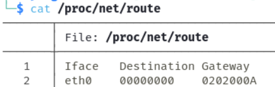
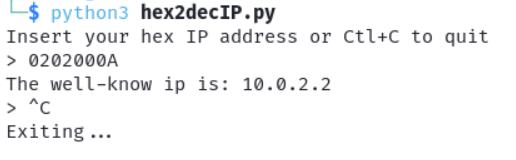

# Little Endian Hexadecimal IP to Decimal IP
This script is made for myself to never forget how to do this stuff. Little endian is a format of data representation in memory that storage the information by the less significative byte to the most significative byte.

## How it works
When you type the command ```cat /proc/net/route``` the ip address are show in little endian hexadecimal format, like this:

<div align="center">
  
</div>

So we can observe the ip in that format is ```02 02 00 0A``` so this means ```2 2 0 10``` in decimal, then the decimal ip will be ```10.0.2.2```.

In the study case the ip will result easy to transform but if the ip is more complex will be hard to transform, so I create this python3 script to simplify the process.
```python3
import signal, sys

def handler(sig, frame):
    print ('\nExiting...')
    sys.exit(1)

signal.signal(signal.SIGINT, handler)

print('Insert your hex IP address or Ctl+C to quit')
while True:
    hex_ip = input('> ')
    if len(hex_ip) == 8:
        try:
            fq = int(hex_ip[6:], 16)
            sq = int(hex_ip[4:6], 16)
            tq = int(hex_ip[2:4], 16)
            lq = int(hex_ip[:2], 16)
            print (f'The well-know ip is: {fq}.{sq}.{tq}.{lq}')
        except:
            print ('There is not a correct format')
    else:
        print ('Something went wrong!')
```

<div align="center">
  
</div>

As we can observe on the image bellow the traduction is correct. If you want to use the scritp you can copy and paste in a file or simply download from the files. Thanks!
